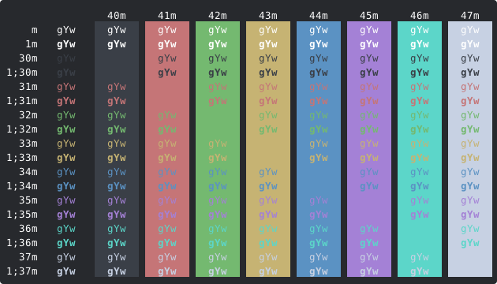

Celina
======

Nice and focused dark theme for iTerm 2 and Terminal.app - also includes oh-my-zsh theme.

To see colors in your terminal once installed, you can run the `colors.sh` shell script

    $ ./colors.sh

---

## Color Value Table

    CELINA  HEX     TERMCOL   RGB
    ------- ------- --------- -----------
    base03  #67707f brblack   103 112 127
    base02  #3a3f48 black      58  63  72
    base01  #a8f6a2 brgreen   168 246 162
    base00  #f3e4b0 bryellow  243 228 176
    base0   #99cdf7 brblue    153 205 247
    base1   #8ef6eb brcyan    142 246 235
    base2   #c7d1e3 white     199 209 227
    base3   #7a8496 brwhite   122 132 150
    yellow  #c6b373 yellow    198 179 115
    orange  #ffaaac brred     255 170 172
    red     #c57577 red       197 117 119
    magenta #a481d6 magenta   164 129 214
    violet  #d6bbf6 brmagenta 214 187 246
    blue    #5b92c3 blue       91 146 195
    cyan    #5cd6c9 cyan       92 214 201
    green   #74b970 green     116 185 112
